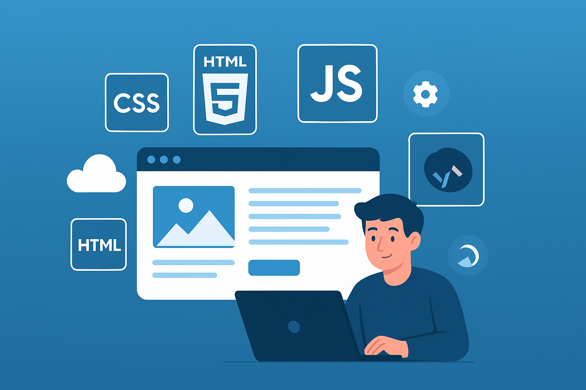

  

<<<<<<< HEAD
<h1 align="center">🚀 Interactive CV & Learning Platform</h1>
=======
Welcome to the official repository for **MyWebsite**, a modern personal portfolio and educational web platform designed to go beyond traditional resumes.
>>>>>>> 6832f973170846b043ad35dd00196a5ae615f6f1

  <b>“Drawing My Own Path”</b> 
  Personal portfolio & learning platform built with modern web technologies.

  
  
  

---

## 📽️ Preview

https://github.com/abdulrahmanhamdi/MyWebsite/assets/demo/interactive-preview.gif  
*Demo GIF or screen recording preview of website* (Add one in assets/img if needed)

---

## 🎯 Project Purpose

> “Drawing My Own Path”

This website is more than a resume — it’s an interactive journey through my:
- 🛠️ Technical skills  
- 🎓 Certifications & achievements  
- 💡 Real-world projects  
- 💬 Educational efforts like **Infinity Team**

---

## 🧠 Features

- 🌗 Dark / Light Theme toggle with smooth transitions  
- 🔍 Section-based smart search + 🔊 voice assistant  
- 🎯 Responsive layout using Bootstrap Grid  
- 🎥 Animated background (particles.js)  
- 🎚️ Custom audio effects + preferences saved via localStorage  
- 👨‍👩‍👧‍👦 Team Cards with tilt effect and tooltip  
- 📆 Countdown section for events  
- 🧭 Sidebar menu with Bootstrap icons  

---

## 👨‍💻 Technologies Used

| Logo | Technology     | Purpose                                |
|------|----------------|-----------------------------------------|
|  | HTML5 / CSS3   | Structure and styling                   |
|  | Bootstrap 5    | Responsive grid and components          |
|  | JavaScript     | Interactivity (search, animation)       |
|  | Swiper.js      | Sliders for testimonials                |
|  | particles.js   | Animated background                     |
| 🧠 | LocalStorage    | Theme and sound preference persistence  |

---

## 💡 Challenges & Solutions

| ❌ Challenge                       | ✅ Solution                              |
|-----------------------------------|------------------------------------------|
| Navbar breaking on small screens | Bootstrap classes + media queries        |
| Poor contrast in dark mode       | Dynamic CSS variables + testing          |
| JS Search not targeting sections | ID-based navigation system               |
| Swiper.js affecting layout       | Scoped versioning + responsive fix       |

---

## 📫 Contact

- 📧 **Email:** [abdulrahmanh524@gmail.com](mailto:abdulrahmanh524@gmail.com)  
- 💼 **LinkedIn:** [linkedin.com/in/abdulrahman-hamdi](https://linkedin.com/in/abdulrahman-hamdi)

---

## 🌟 Thank You!

  

> If you liked this project, don’t forget to ⭐ the repository and share your feedback!

